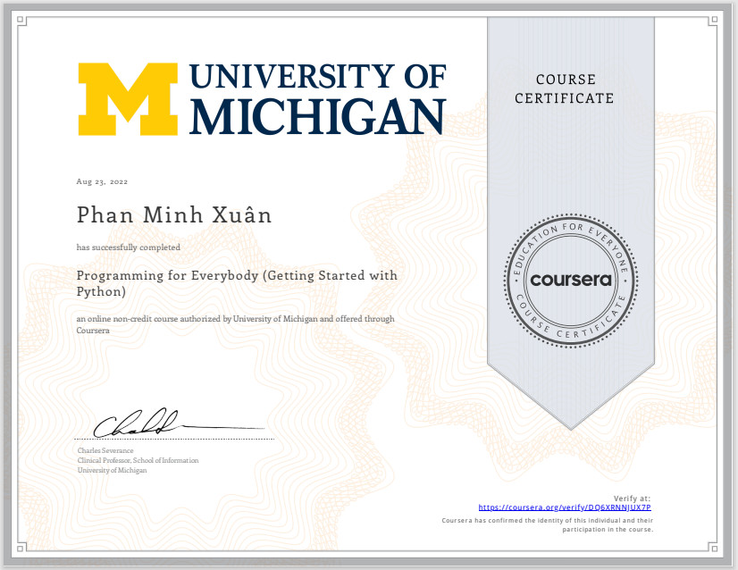
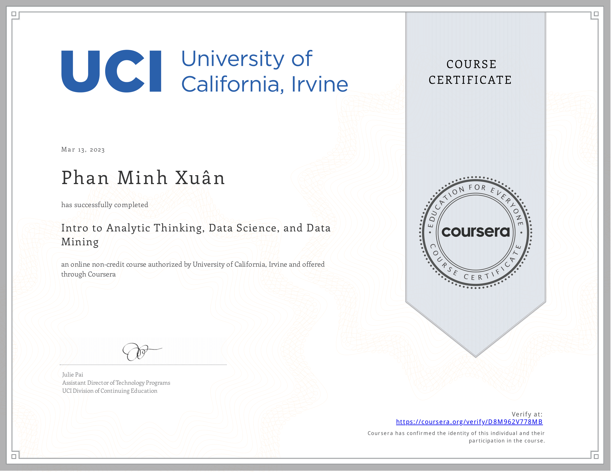

- ✍ I'm a student of: [ University of Sciences](https://www.hcmus.edu.vn/) (HCMUS).

- 🌱 DA, DS

## 📫 Contacts:

  </a>
   
   
    
  
  

## Skills:

  
  
  
  
 
  
  
  
  

<table style="width:100%;">
  <tr>
    <td>
      
      
    </td>
    <td>
      
 
        
      

    </td>
  </tr>
</table>

# Certificates:

  
  

  
    

